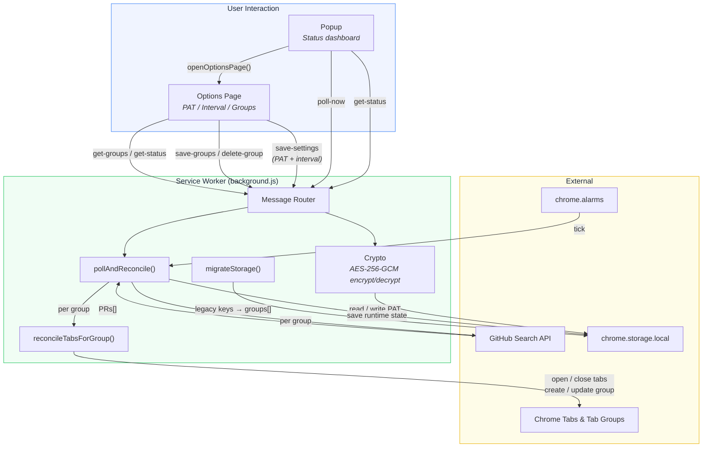
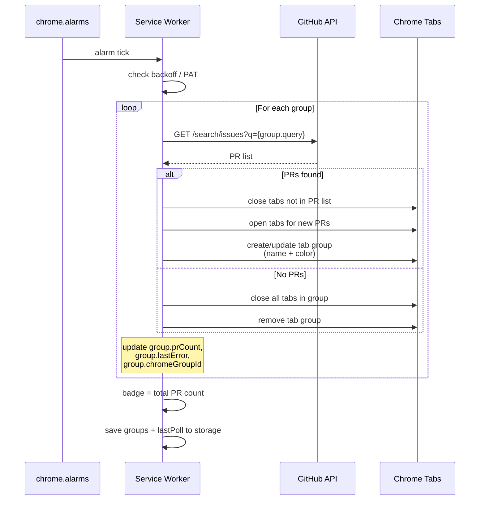
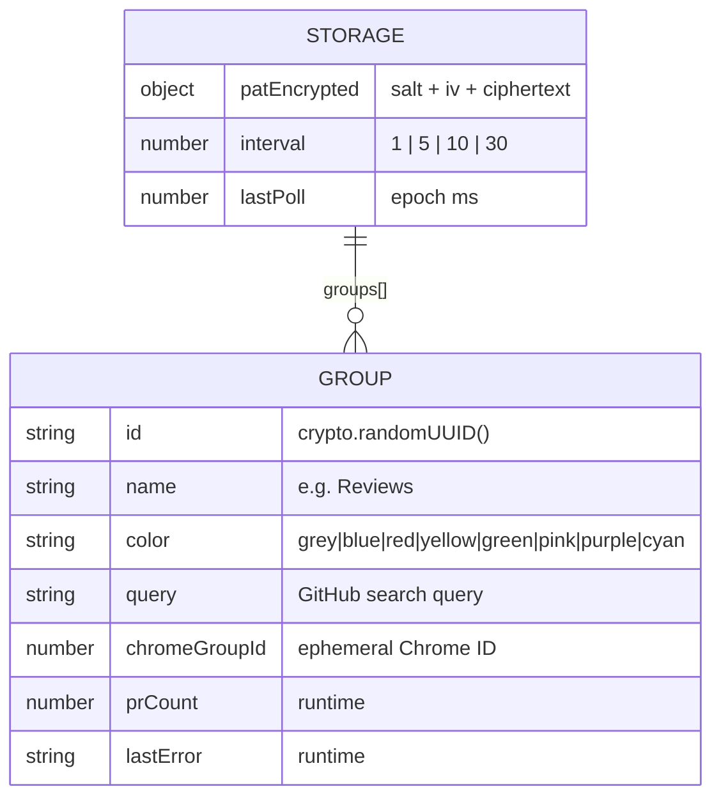

# PR Patrol

A Chrome extension that automatically manages tab groups for GitHub pull requests awaiting your review. It polls the GitHub Search API on a configurable interval and keeps color-coded tab groups in sync — opening new tabs for incoming PRs and closing tabs for PRs you've already reviewed. Supports multiple groups with custom names, colors, and search queries.

## Features

- **Multiple groups** — define as many tab groups as you need, each with its own name, color, and GitHub search query
- Automatic polling via `chrome.alarms` (1, 5, 10, or 30 minute intervals)
- Badge counter showing the total number of pending reviews across all groups
- PAT encrypted at rest using AES-256-GCM
- Token validation against the GitHub API before saving
- Rate-limit backoff with automatic recovery
- Dedicated options page for managing PAT, interval, and groups
- Popup shows a quick status dashboard with per-group PR counts

## Setup

1. **Generate a GitHub PAT** — go to [Settings > Developer settings > Personal access tokens](https://github.com/settings/tokens) and create a token with the `repo` scope (classic) or `read` access to pull requests (fine-grained)
2. **Install the extension**
   - Open `chrome://extensions`
   - Enable **Developer mode**
   - Click **Load unpacked** and select the `pr-patrol` directory
3. **Configure** — click the extension icon, then the gear icon to open settings. Paste your PAT, choose a poll interval, and configure your groups.

## Architecture

### Polling & Reconciliation Flow

### Storage Schema

## Permissions

| Permission | Why |
|---|---|
| `tabs` | Create, query, and close tabs |
| `tabGroups` | Manage color-coded tab groups |
| `storage` | Persist encrypted PAT, settings, and groups |
| `alarms` | Schedule periodic polling |
| `https://api.github.com/*` | GitHub API access |

## Security

The PAT is encrypted before storage and never exposed to the popup UI. See [SECURITY.md](SECURITY.md) for full details on the threat model, implemented controls, and known limitations.
